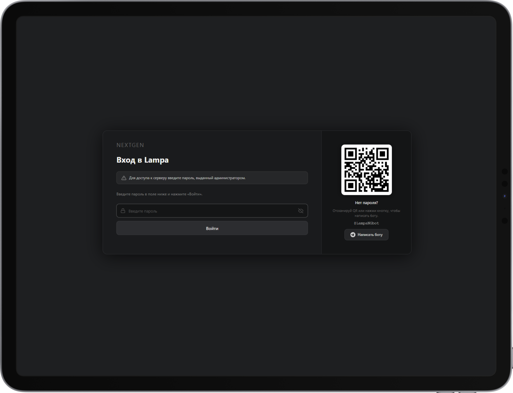
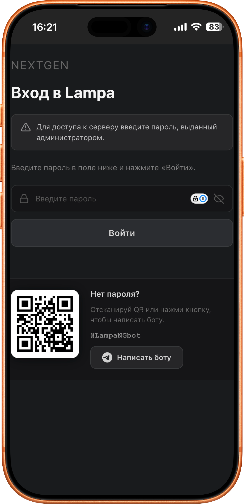

# DenyPageCustom

[](https://github.com/badbadtrip/DenyPageCustom/releases)
[](LICENSE)
[](https://github.com/lampac-nextgen/lampac)
[](https://github.com/lampac-nextgen/lampac)
[](https://deepwiki.com/badbadtrip/DenyPageCustom)

> Динамический плагин для [Lampac NextGen](https://github.com/lampac-nextgen/lampac) — генерирует кастомную страницу авторизации `plugins/override/deny.js` на основе секции `[DenyPage]` в `init.conf`. Горячая перезагрузка, QR-код Telegram, адаптивная вёрстка.

---

## Содержание

- **[Скриншоты](#скриншоты)**
- **[Возможности](#возможности)**
- **[Установка](#установка)**
- **[Конфигурация](#конфигурация)**
- **[Поля конфигурации](#поля-конфигурации)**
- **[Логика авторизации](#логика-авторизации)**
- **[Разработка](#разработка)**
  - [Архитектура](#архитектура)
  - [Адаптивная вёрстка](#адаптивная-вёрстка)
  - [Добавление нового поля конфигурации](#добавление-нового-поля-конфигурации)
  - [Структура сгенерированного файла](#структура-сгенерированного-файла)
  - [manifest.json](#manifestjson)
- **[Лицензия](#лицензия)**

---

## Скриншоты

<p align="center">
  
  
</p>

---

## Возможности

| | |
|---|---|
| **Кастомизация текстов** | Заголовок, подзаголовок, шаги инструкции, подписи QR-блока — всё через `init.conf` |
| **QR-код Telegram** | Генерируется автоматически для любого бота/канала; скрывается, если `tg_target` не задан |
| **Горячая перезагрузка** | `"dynamic": true` — изменения применяются без перезапуска сервера |
| **Хэш-диффинг** | Файл перезаписывается только при реальных изменениях конфига |
| **Защита от XSS** | Все строки из конфига экранируются через `JsonSerializer.Serialize` |
| **Адаптивный дизайн** | TV, Desktop, планшет, мобильный, ландшафт |

---

## Установка

> [!NOTE]
> Lampac NextGen использует **Roslyn** — `.cs` файлы компилируются сервером автоматически. Предварительная сборка в DLL не требуется.

**1.** Скопируйте папку `DenyPageCustom` в директорию `mods/` рядом с исполняемым файлом Lampac:

```
mods/
└── DenyPageCustom/
    ├── manifest.json
    ├── ModInit.cs
    ├── DenyPageGenerator.cs
    └── Models/
        └── DenyPageConf.cs
```

**2.** Перезапустите сервер — Roslyn скомпилирует модуль автоматически.

**3.** При `"dynamic": true` (уже в `manifest.json`) последующие изменения `.cs` файлов применяются **без перезапуска**.

> [!TIP]
> Файл `plugins/override/deny.js` создаётся автоматически в директории установки сервера — редактировать его вручную не нужно, он перезаписывается при каждом изменении конфига.

---

## Конфигурация

Параметры задаются в секции `[DenyPage]` файла `init.conf`.

> [!TIP]
> Изменения применяются автоматически — перезапуск сервера не требуется.

```json
"DenyPage": {
  "tg_target": "@YourBot",
  "show_qr": true,
  "page_title": "Вход в систему",
  "page_subtitle": "Для доступа к серверу введите пароль, выданный администратором.",
  "step1_text": "Введите пароль в поле ниже и нажмите «Войти».",
  "qr_caption": "Нет пароля?",
  "qr_subcaption": "Отсканируй QR или нажми кнопку, чтобы написать боту.",
  "tg_button_text": "Написать боту"
}
```

---

## Поля конфигурации

<details>
<summary><b>Все поля с описанием</b></summary>

<br>

| Поле | Тип | Описание |
|---|---|---|
| `tg_target` | `string` | Управляет QR-блоком. Принимает `@username`, `https://t.me/…` или `tg://` |
| `show_qr` | `bool` | QR отображается только если `tg_target` задан **и** `show_qr = true` |
| `page_title` | `string` | Заголовок страницы ✓ |
| `page_subtitle` | `string` | Подзаголовок ✓ |
| `step1_text` | `string` | Текст шага 01 ✓ |
| `qr_caption` | `string` | Заголовок QR-блока ✓ |
| `qr_subcaption` | `string` | Подпись QR-блока ✓ |
| `tg_button_text` | `string` | Текст кнопки Telegram ✓ |
| `page_badge` | `string` | Значение вычисляется, HTML-элемент удалён |
| `step2_text` | `string` | В модели; не выводится в HTML |
| `hint_text` | `string` | В модели; не используется |
| `footer_text` | `string` | В модели; не используется |
| `qr_size` | `int` | В модели; размер захардкожен в генераторе |
| `show_password_button` | `bool` | В модели; кнопка show/hide есть всегда |
| `show_cub_button` | `bool` | В модели; не используется |
| `show_please_wait` | `bool` | В модели; не используется |
| `instruction_url` | `string` | В модели; не используется |
| `instruction_text` | `string` | В модели; не используется |

### Форматы `tg_target`

> [!TIP]
> Все варианты нормализуются автоматически — достаточно указать `@username`.

```
@mybotname          →  https://t.me/mybotname
mybotname           →  https://t.me/mybotname
https://t.me/bot    →  https://t.me/bot         (без изменений)
tg://resolve?...    →  tg://resolve?...          (без изменений)
```

</details>

---

## Логика авторизации

<details>
<summary><b>Как работает deny.js</b></summary>

<br>

Сгенерированный `deny.js` внедряет две функции:

**`checkAutch()`** — вызывается немедленно при загрузке. Отправляет GET на `{localhost}/testaccsdb`. Если `res.accsdb = true`:
- Скрывает UI (`#app`), устанавливает `window.sync_disable = true`
- Через 500 мс вызывает `addDevice()`

**`addDevice(message)`** — рендерит полноэкранную форму входа в `document.body`.

```
POST {localhost}/testaccsdb?account_email=<пароль>&uid=<uid>
```

| Результат | Поведение |
|---|---|
| `success = true`, `uid` задан | Аккаунт создан — показывает UID, редирект на `/` через 3 сек |
| `success = true`, `uid` не задан | Сохраняет пароль как `lampac_unic_id`, редирект на `/` |
| `success = false` | Показывает «Неправильный пароль» |
| Ошибка сети | Показывает «Ошибка соединения» |

> [!NOTE]
> QR-изображение загружается в runtime с `api.qrserver.com` — не бандлится в плагин. Требуется доступ в интернет на устройстве пользователя.

</details>

---

## Разработка

<details>
<summary><b>Архитектура</b></summary>

<br>

```
DenyPageCustom/
├── manifest.json          # Метаданные плагина для Lampac
├── ModInit.cs             # Точка входа: IModuleLoaded, таймер, подписка на события
├── DenyPageGenerator.cs   # Генератор JS-файла (чистый static builder)
└── Models/
    └── DenyPageConf.cs    # Модель конфигурации с дефолтами
```

**`ModInit.cs`** — точка входа (`IModuleLoaded`):
- При загрузке создаёт директорию вывода, вызывает `SyncAndGenerate()` один раз
- Подписывается на `EventListener.UpdateInitFile` (обновление `init.conf`)
- Таймер на 3 секунды — резервный механизм синхронизации

**`DenyPageGenerator.cs`** — статический построитель:
- `Build(DenyPageConf)` возвращает полное содержимое `deny.js`
- QR-колонка генерируется только если `tg_target` задан и `show_qr = true`

**`Models/DenyPageConf.cs`** — модель конфигурации:
- Заполняется через `ModuleInvoke.Init("DenyPage", new DenyPageConf())` из `init.conf`
- Все поля имеют значения по умолчанию

</details>

<details>
<summary><b>Адаптивная вёрстка</b></summary>

<br>

| Условие | Поведение |
|---|---|
| TV (≥ 1400px) | Макс. ширина 1100px, высота 85vh, QR 180×180px |
| Desktop (> 900px) | Два столбца: форма слева, QR-блок справа (280px) |
| Планшет (700–900px) | Два столбца, QR-блок 240px |
| Мобильный (≤ 700px) | Один столбец: QR-блок над формой, QR 120×120px |
| Ландшафт (h ≤ 500px) | QR-блок справа (border-left), ширина 220px |
| Маленький экран (≤ 420px) | Минимальные отступы (24px/20px) |

</details>

<details>
<summary><b>Добавление нового поля конфигурации</b></summary>

<br>

1. Добавьте свойство в `Models/DenyPageConf.cs` с дефолтным значением
2. Используйте значение в `DenyPageGenerator.Build()` — включите в генерируемый HTML/JS
3. Обновите таблицу полей в этом README

</details>

<details>
<summary><b>Структура сгенерированного файла</b></summary>

<br>

```
deny.js
├── CSS (инлайн, через <style>)
├── SVG-иконки как JS-переменные (warn, lock, eye, tg)
├── function addDevice(message)   — форма входа + обработчики
└── function checkAutch()         — проверка авторизации + вызов addDevice
    └── checkAutch();             — немедленный вызов в конце файла
```

</details>

<details>
<summary><b>manifest.json</b></summary>

<br>

```json
{
  "name": "DenyPageCustom",
  "enable": true,
  "dynamic": true
}
```

| Поле | Описание |
|---|---|
| `name` | Идентификатор плагина (должен совпадать с именем DLL) |
| `enable` | `true` — плагин активируется при старте |
| `dynamic` | `true` — горячая перезагрузка при изменении `.cs` |

</details>

---

## Лицензия

[MIT](LICENSE)
